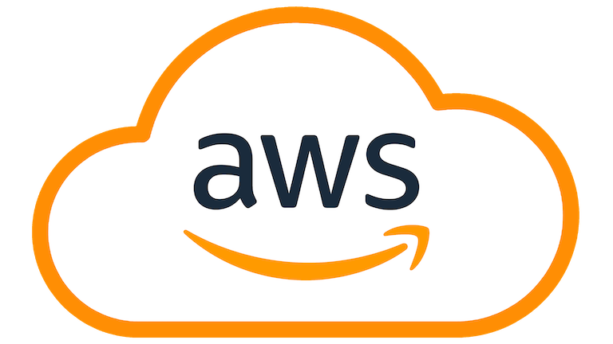
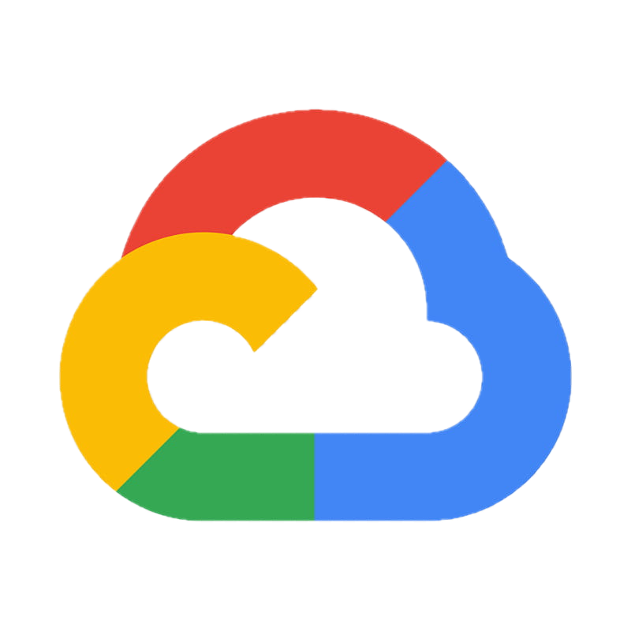

# Cloud Infrastructure Examples

Collection of infrastructure-as-code examples using Terraform for AWS, Azure and Google Cloud platforms.

## AWS Examples

### [EC2 NAT Instance](aws-ec2-nat-instance/)
Cost-effective NAT solution using EC2 instance instead of AWS NAT Gateway.

### [Multi-Region Hub-Spoke with Transit Gateways](aws-multi-region-hub-spoke-with-transit-gateways/)
Multi-region network architecture using Transit Gateways for centralized routing.

### [Lambda VPC Outbound with NAT Gateway](aws-lambda-vpc-outbound-with-nat-gateway/)
Lambda function in VPC with internet access through NAT Gateway.

## Azure Examples

### [Free App Service with Docker](azure-free-app-service-with-docker/)
Deploys a containerized application using Azure's free-tier App Service.

### [Route Server with NVA Peering](azure-route-server-peering-nva/)
Hub-spoke network with Azure Route Server and Network Virtual Appliance (NVA) for BGP routing.

### [Azure DevOps Pipeline with Terraform](azure-devops-pipeline-terraform/)
Automated infrastructure deployment using Azure DevOps pipelines and Terraform, including VM provisioning and network setup.

### [Hub-Spoke with Central Azure Firewall](azure-hub-spoke-with-azure-firewall/)
Hub-spoke network with a central Azure Firewall for secure traffic inspection and control across spokes.

## Google Cloud Examples

### [Google Cloud Network Connectivity Center with Router Appliance](google-cloud-ncc-router-appliance/)
Hub-spoke network with Google Cloud Network Connectivity Center and Router appliance for BGP routing.

### [Cloud Run VPC Integration with VPN](google-cloud-cloud-run-vpc-integration/)
Cloud Run service with direct VPC egress and VPN tunnel integration for on-premises connectivity.

## Cloudflare Examples

### [Cloudflare Zero Trust Private Web Application](cloudflare-zero-trust-web-application/)

## Usage

Each folder contains:
- Complete Terraform configurations
- Detailed README with setup instructions
- Architecture diagrams (where applicable)

## Prerequisites

- AWS/Azure account
- Terraform >= 1.0
- AWS CLI / Azure CLI / gcloud installed
- Basic cloud networking knowledge

## Note
These configurations may create cloud resources that incur costs. Remember to destroy resources after testing.

For more detailed articles about cloud networking and infrastructure, visit [gergovadasz.hu](https://gergovadasz.hu)
