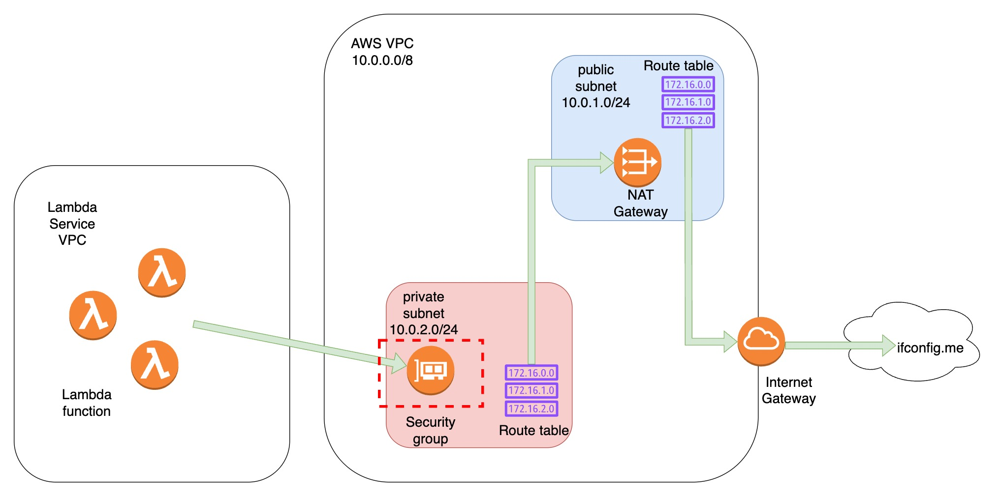

# AWS Lambda with VPC Access

This project demonstrates how to set up an AWS Lambda function that runs within a VPC and can access the internet through a NAT Gateway. The Lambda function checks its public IP address by making an HTTP request to ifconfig.me.

## Architecture



The infrastructure consists of:
- A VPC with CIDR block 10.0.0.0/16
- A public subnet (10.0.1.0/24) with internet access via Internet Gateway
- A private subnet (10.0.2.0/24) with internet access via NAT Gateway
- A Lambda function running in the private subnet
- All necessary IAM roles and security groups

## Components

### VPC Configuration
- VPC with DNS support enabled
- Public subnet with auto-assign public IP
- Private subnet for Lambda function
- Internet Gateway for public subnet
- NAT Gateway with Elastic IP for private subnet
- Route tables for both subnets

### Lambda Function
- Python 3.9 runtime
- 128MB memory allocation
- 30-second timeout
- VPC configuration to run in private subnet
- Security group allowing outbound internet access
- IAM role with VPC access permissions

## Prerequisites
- AWS CLI configured with appropriate credentials
- Terraform installed
- Python 3.9 (for local testing)

## Setup

1. Initialize Terraform:
```bash
terraform init
```

2. Apply the configuration:
```bash
terraform plan
terraform apply
```

3. Test the Lambda function:
```bash
aws lambda invoke --function-name ip-checker --payload '{}' --cli-binary-format raw-in-base64-out --no-cli-pager /dev/stdout
```

## Project Structure
```
.
├── provider.tf      # AWS provider configuration
├── vpc.tf          # VPC, subnets, and networking components
├── lambda.tf       # Lambda function and IAM configuration
├── index.py        # Lambda function code
└── lambda_function.zip  # Zipped Lambda function
```

## Notes
- The Lambda function runs in a private subnet but can access the internet through the NAT Gateway
- The public IP returned by the Lambda function will be the Elastic IP associated with the NAT Gateway
- The Lambda function has a 1-second delay to ensure proper warm-up 