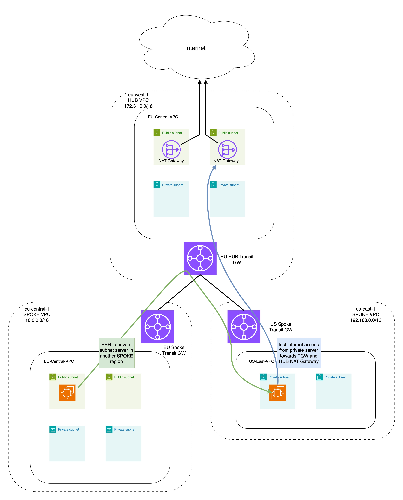

# Multi-Region AWS Transit Gateway Hub and Spoke Network

This Terraform project creates a hub and spoke network topology across multiple AWS regions using Transit Gateways. The architecture enables centralized internet egress through the hub VPC's NAT Gateways.

## Architecture Diagram



## Architecture Overview

### Hub VPC (eu-west-1)
- Functions as the central hub for inter-VPC communication
- Provides centralized internet access via NAT Gateways
- Contains:
  - Public subnets with Internet Gateway
  - Private subnets with NAT Gateways
  - Transit Gateway for spoke connectivity

### EU Spoke VPC (eu-central-1)
- Connected to hub via Transit Gateway peering
- Contains:
  - Public subnets with Internet Gateway (for direct internet access)
  - Private subnets (internet access through hub NAT Gateways)
  - Ubuntu server in public subnet (for testing connectivity)

### US Spoke VPC (us-east-1)
- Connected to hub via Transit Gateway peering
- Contains:
  - Private subnets only (internet access through hub NAT Gateways)
  - Ubuntu server in private subnet

## Network Flow Examples

### Internet Access from Private Subnets
1. Traffic from private instances → Local Transit Gateway
2. Transit Gateway → Hub Transit Gateway (via peering)
3. Hub Transit Gateway → Hub VPC private subnets
4. Hub private subnets → NAT Gateways → Internet

### Inter-Spoke Communication
- Traffic between spokes is routed through the hub Transit Gateway
- Example: US private server → EU public server path:
  1. US server → US Transit Gateway
  2. US TGW → Hub TGW → EU TGW
  3. EU TGW → EU public subnet

## Test Setup
The project includes two test servers:
1. Public server in EU Central (eu-central-1)
   - Located in public subnet
   - Accessible directly from internet
   - Key pair: "aws-key"

2. Private server in US East (us-east-1)
   - Located in private subnet
   - Internet access through hub NAT Gateways
   - Key pair: "test"

### Testing Connectivity
You can:
1. Copy your key pair to the EU server (from your local machine)
2. SSH to the EU public server
3. From the EU server, SSH to the US private server
4. Test internet connectivity from the US server (should work through hub NAT)

## Components
- 3 VPCs across 3 regions
- 3 Transit Gateways with peering connections
- NAT Gateways in hub VPC
- Route tables configured for:
  - Inter-VPC communication via Transit Gateways
  - Internet access via hub NAT Gateways
  - Direct internet access where needed (public subnets)

## Prerequisites

### Required Tools
- Terraform >= 1.0
- AWS CLI configured with appropriate credentials
- Access to three AWS regions (eu-west-1, eu-central-1, us-east-1)

### AWS Account Requirements
- Sufficient privileges to create VPCs, Transit Gateways, and related resources
- Service quotas for Transit Gateway peering across regions
- Ability to create resources in all three regions

### SSH Key Pairs
Before deploying this infrastructure, you need to have created an SSH key pair in both regions:
- eu-central-1 (for EU public server)
- us-east-1 (for US private server)

The configuration expects a key pair named "aws-key-pair" in both regions. You need to either:
1. Create key pairs with this name in both regions, or
2. Modify the key_name values in instances.tf to match your existing key pairs

```hcl
# For EU public server (eu-central-1)
resource "aws_instance" "eu_spoke_public" {
  key_name = "aws-key-pair"  # CHANGE THIS to your AWS key pair name
  ...
}

# For US private server (us-east-1)
resource "aws_instance" "us_spoke_private" {
  key_name = "aws-key-pair"  # CHANGE THIS to your AWS key pair name
  ...
}
```

**Note:** Make sure you have created the key pair in both regions before deploying, or the deployment will fail.

## Cost Considerations

This architecture involves several billable components across multiple regions:

- Transit Gateway hourly charges (3 regions)
- Transit Gateway data processing
- Transit Gateway peering attachment charges
- NAT Gateway hourly charges
- NAT Gateway data processing
- EC2 instance charges
- VPC data transfer (inter-region)
- Internet data transfer

Consider implementing AWS Cost Explorer tags to track expenses by component.

## Security Considerations

- All inter-region traffic is encrypted by default through Transit Gateway peering
- Private subnets have no direct internet access
- Access to instances is controlled via security groups and NACLs
- Internet egress is centralized through the hub region for better monitoring
- Consider implementing AWS Network Firewall in the hub VPC for additional security

## Limitations and Considerations

- Transit Gateway peering increases network latency
- Cross-region data transfer costs can be significant
- Single region hub creates a potential bottleneck
- Consider implementing:
  - Multi-region hub redundancy
  - Region-local internet egress for latency-sensitive applications
  - VPC Flow Logs for network monitoring
  - AWS Network Firewall for enhanced security

## Getting Started

### Deployment
1. Initialize Terraform (downloads providers and modules):
   ```bash
   terraform init
   ```

2. Review the deployment plan:
   ```bash
   terraform plan
   ```

3. Apply the configuration:
   ```bash
   terraform apply
   ```

### Testing the Setup
1. Get the public IP of the EU server from Terraform output or AWS Console

2. Copy your key pair to the EU server (from your local machine):
   ```bash
   scp -i path/to/aws-key-pair.pem path/to/aws-key-pair.pem ubuntu@<EU-SERVER-PUBLIC-IP>:~/.ssh/
   ```

3. SSH to the EU public server:
   ```bash
   ssh -i path/to/aws-key-pair.pem ubuntu@<EU-SERVER-PUBLIC-IP>
   ```

4. From the EU server, SSH to the US private server:
   ```bash
   ssh -i ~/.ssh/aws-key-pair.pem ubuntu@<US-SERVER-PRIVATE-IP>
   ```

5. Test connectivity from the US private server:
   ```bash
   # Test internet access
   ping google.com

   # Check the public IP (should be the HUB NAT Gateway IP)
   curl ifconfig.me
   ```

**Note:** Without copying the key pair to the EU server, you won't be able to SSH from there to the US private server.

### Cleanup
When you're done testing, destroy all resources to avoid unnecessary charges:
```bash
terraform destroy
```

**Note:** Make sure to confirm the destroy command when prompted. This will remove all resources created by this project across all three regions.
