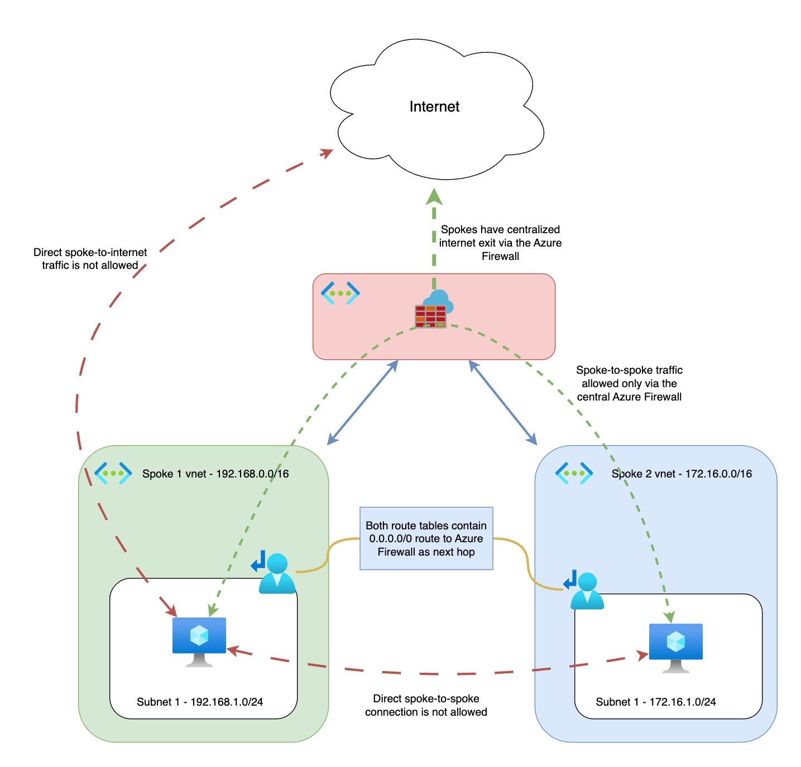

## Azure Hub-Spoke with Central Azure Firewall

This Terraform project deploys a minimal hub-spoke network topology on Azure with a central Azure Firewall in the hub. Two spokes contain small Linux VMs with public IPs for connectivity testing, and routing is configured so spoke traffic is inspected by the firewall. A specific exception route allows a given IP to reach the VMs directly via the Internet for SSH.

### Architecture
- **Hub VNet**: `10.0.0.0/16`
  - Subnet `AzureFirewallSubnet` (required name), `10.0.1.0/26`
  - Azure Firewall with public IP
- **Spoke1 VNet**: `192.168.0.0/16` with subnet `192.168.1.0/24`
- **Spoke2 VNet**: `172.16.0.0/16` with subnet `172.16.1.0/24`
- **Peerings**: Hub <-> Spoke1 and Hub <-> Spoke2 with forwarded traffic allowed
- **Routing**:
  - Spoke subnets have a default route `0.0.0.0/0` pointing to the Azure Firewall private IP (Virtual Appliance)
  - Explicit route for `1.2.3.4/32` with next hop `Internet` so you can SSH directly from that IP. Replace this with your own public IP.
- **Firewall rules**: Allow ICMP and TCP 22/80/443 between the two spoke subnets in both directions, and allow TCP 80/443 from both spokes to the Internet
- **Test VMs**: One Ubuntu 22.04 VM in each spoke with a public IP, NSG allows SSH and intra-VNet traffic

### Diagram
The architecture diagram is included in the repo:



### Prerequisites
- Terraform >= 1.5
- Azure subscription and permissions to create networking, public IPs, and compute resources
- Azure CLI authenticated (e.g., `az login`) or ARM_* environment variables set

### Quick start
1. Initialize providers
   - `terraform init`
2. Review plan
   - `terraform plan`
3. Apply
   - `terraform apply`

To destroy all resources:
- `terraform destroy`

### Variables
- `prefix` (string): Naming prefix for all resources. Default: `hubspoke`
- `location` (string): Azure region. Default: `westeurope`

Change these via a `terraform.tfvars` file or `-var` CLI flags if desired.

### Outputs
- `resource_group_name`: Resource group name
- `hub_vnet_id`, `spoke1_vnet_id`, `spoke2_vnet_id`: VNet resource IDs
- `firewall_private_ip`, `firewall_public_ip`: Azure Firewall IPs
- `spoke1_vm_public_ip`, `spoke2_vm_public_ip`: VM public IP addresses

### Accessing the test VMs
- Username: `azureuser`
- Password: `Password123!`

After `apply`, get the VM IPs:
- `terraform output -raw spoke1_vm_public_ip`
- `terraform output -raw spoke2_vm_public_ip`

SSH examples:
```bash
ssh azureuser@$(terraform output -raw spoke1_vm_public_ip)
ssh azureuser@$(terraform output -raw spoke2_vm_public_ip)
```

From either VM, you can test spoke-to-spoke connectivity:
```bash
# ICMP
ping 192.168.1.4   # or the actual private IP of the Spoke1/Spoke2 VM
ping 172.16.1.4

# TCP (examples)
curl -I http://172.16.1.4
```

Test outbound Internet via the Firewall (egress SNAT):
```bash
# This should print the Azure Firewall public IP
curl -s ifconfig.me && echo
```

Note: Replace target private IPs with those assigned in your deployment.

### Files
- `versions.tf`: Terraform and provider requirements
- `variables.tf`: Input variables
- `main.tf`: Resource group
- `hub.tf`: Hub VNet, `AzureFirewallSubnet`, Azure Firewall, hub-side peerings
- `spoke1.tf`: Spoke1 VNet, subnet, peering to hub, route table + association
- `spoke2.tf`: Spoke2 VNet, subnet, peering to hub, route table + association
- `servers.tf`: NSG, public IPs, NICs, and small Ubuntu VMs in each spoke
- `firewall_rules.tf`: Azure Firewall network rule collections allowing ICMP and TCP 22/80/443 between spokes, and allowing TCP 80/443 from spokes to the Internet
- `outputs.tf`: Useful outputs (firewall IPs, VNet IDs, VM public IPs)

### Important details
- The default route `0.0.0.0/0` in both spoke route tables forwards traffic to the Azure Firewall.
- A specific route for `1.2.3.4/32` with next hop `Internet` is added to both spoke route tables so you can SSH directly from that IP without being hairpinned through the firewall.
  - To change this, update the route named `to-your-public-ip` in `spoke1.tf` and `spoke2.tf`.
- Azure Firewall rules in `firewall_rules.tf` allow ICMP and TCP 22/80/443 between the two spoke subnets in both directions, and allow TCP 80/443 from spokes to the Internet.
- The NSG applied to VM NICs allows SSH from anywhere and intra-VNet traffic.
- Terraform apply and destroy can take a while to complete, for me it took around 15-20 minutes. 

### Security notes
- The VM password is defined in code for demo purposes. For production, use SSH keys, secret management (e.g., Azure Key Vault), and restrict NSG rules to your management IPs.
- This deployment creates public endpoints and incurs costs. Destroy resources when finished. 