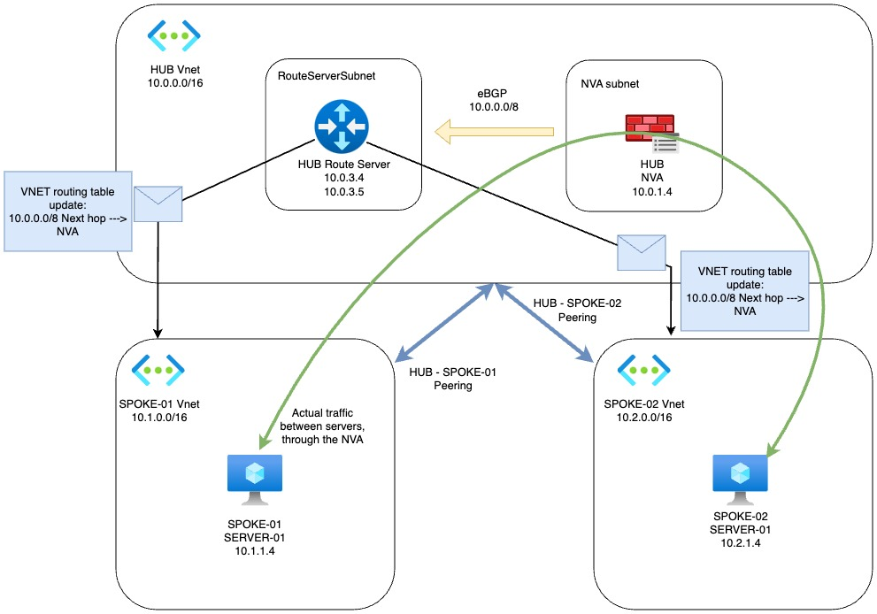

# Azure Hub-Spoke Network with Route Server and NVA

This Terraform configuration creates a hub-spoke network topology in Azure with a Route Server and Network Virtual Appliance (NVA) for centralized routing. I use a ubuntu server with FRR BGP to mimic instead of using a true 3rd party NVA (Cisco, Palo Alto, etc.)

## Architecture Diagram



## Architecture Overview

The infrastructure consists of:

### Hub Network (10.0.0.0/16)
- Hub VNet with multiple subnets:
  - hub-subnet1 (10.0.1.0/24) - Contains the NVA
  - hub-subnet2 (10.0.2.0/24)
  - RouteServerSubnet (10.0.3.0/27) - Required for Azure Route Server
- Azure Route Server for dynamic route propagation
- Ubuntu-based NVA with:
  - FRR for BGP routing
  - BGP peering with Route Server (ASN 65020)
  - IP forwarding enabled

### Spoke Networks
- Spoke1 VNet (10.1.0.0/16):
  - spoke1-subnet1 (10.1.1.0/24)
  - spoke1-subnet2 (10.1.2.0/24)
  - Test VM in subnet1

- Spoke2 VNet (10.2.0.0/16):
  - spoke2-subnet1 (10.2.1.0/24)
  - spoke2-subnet2 (10.2.2.0/24)
  - Test VM in subnet1

### Network Peering
- Bi-directional peering between hub and spokes
- Gateway transit enabled on hub
- Remote gateway use enabled on spokes

### Virtual Machines
- NVA (hub-subnet1):
  - Ubuntu 22.04 LTS
  - BGP configured with FRR
  - IP forwarding enabled
  - Static private IP: 10.0.1.4
  
- Spoke VMs:
  - Ubuntu 22.04 LTS
  - Public IP for management access
  - NSG allowing SSH access
  - Dynamic private IPs

## Files Structure

- `resource_group.tf` - Creates the resource group for all resources
- `virtual_networks.tf` - Defines VNets, subnets, and Route Server configuration
- `vnet_peering.tf` - Configures VNet peering between hub and spokes
- `nva.tf` - Deploys and configures the Network Virtual Appliance with BGP
- `servers.tf` - Creates test VMs in spoke networks with NSGs
- `variables.tf` - Contains variable definitions (if any)

## Prerequisites

- Azure subscription
- Terraform installed
- Azure CLI installed and authenticated
- SSH key pair at `~/.ssh/id_rsa.pub` for VM access

## Usage

1. Initialize Terraform:
```bash
terraform init
```

2. Review the plan:
```bash
terraform plan
```

3. Apply the configuration:
```bash
terraform apply
```

## Testing Connectivity

1. SSH into spoke VMs using their public IPs:
```bash
ssh admin@<spoke-vm-public-ip>
```

2. Test connectivity between spokes (traffic should flow through the NVA):
```bash
# From spoke1-vm
ping 10.2.1.4  # spoke2-vm private IP
```

3. Verify BGP routes on the NVA:
```bash
# SSH into NVA first
ssh admin@<nva-public-ip>

# Check BGP status
sudo vtysh -c 'show ip bgp'
sudo vtysh -c 'show ip bgp summary'
sudo vtysh -c 'show ip route bgp'
```

## Notes

- The NVA is configured to advertise the entire 10.0.0.0/8 range via BGP
- Route Server is configured with branch-to-branch traffic enabled
- Route Server uses ASN 65515 (Azure default)
- NVA uses ASN 65020
- All VMs use the same SSH key for access
- NSGs are configured to allow inbound SSH from any source (0.0.0.0/0)

## Clean Up

To destroy all resources:
```bash
terraform destroy
```

## Security Considerations

- Production environments should restrict SSH access to specific IP ranges
- Consider implementing additional NSG rules for production workloads
- Consider using Azure Bastion for secure VM access
- Consider implementing Azure Firewall instead of a custom NVA for production use

## Limitations

- This setup uses basic Ubuntu VMs for testing
- NSG rules are minimal for demonstration purposes
- No high availability configuration for the NVA
