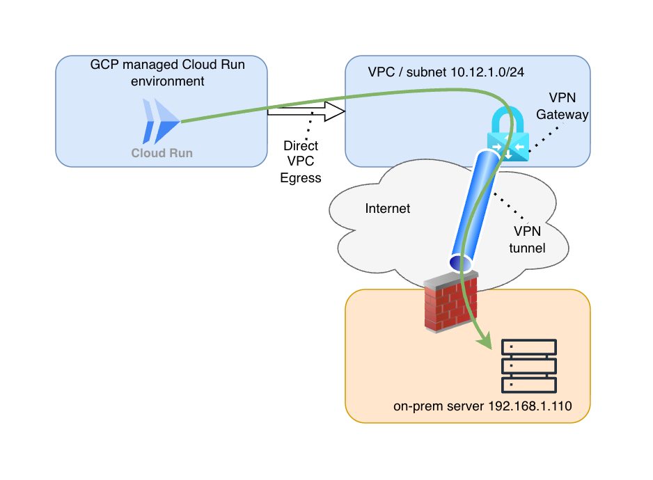
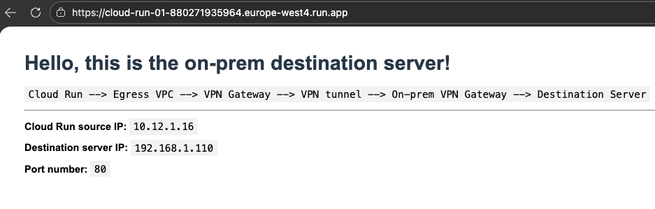

# Google Cloud Run VPC Integration with VPN

This Terraform module creates:
- A VPC network with a subnet (10.12.1.0/24) in europe-west4
- A VPN gateway in the VPC
- A classic VPN tunnel with route-based configuration
- A route to direct traffic through the VPN tunnel

**Note**: The Cloud Run service is deployed separately (see deployment section below) to allow flexibility in image management.

## Prerequisites

1. Google Cloud SDK installed and configured
2. Terraform >= 1.0 installed
3. A GCP project with the following APIs enabled:
   - Cloud Run API
   - Compute Engine API
   - Cloud Resource Manager API

## Setup

1. **Configure your GCP project**:
   ```bash
   gcloud config set project YOUR_PROJECT_ID
   ```

2. **Enable required APIs**:
   ```bash
   gcloud services enable \
     run.googleapis.com \
     compute.googleapis.com \
     cloudresourcemanager.googleapis.com
   ```

3. **Create terraform.tfvars**:
   ```bash
   cp terraform.tfvars.example terraform.tfvars
   ```
   Edit `terraform.tfvars` and set your `project_id`.

4. **Initialize Terraform**:
   ```bash
   terraform init
   ```

5. **Review the plan**:
   ```bash
   terraform plan
   ```

6. **Apply the configuration**:
   ```bash
   terraform apply
   ```

## Configuration

### Variables

- `project_id` (required): Your GCP project ID
- `region` (optional, default: "europe-west4"): GCP region
- `vpc_name` (optional, default: "cloud-run-vpc"): Name of the VPC network
- `subnet_name` (optional, default: "cloud-run-subnet"): Name of the subnet
- `subnet_cidr` (optional, default: "10.12.1.0/24"): CIDR block for the subnet
- `cloud_run_service_name` (optional, default: "cloudrun-service"): Name of the Cloud Run service
- `vpn_gateway_name` (optional, default: "vpn-gateway"): Name of the VPN gateway
- `vpn_tunnel_name` (optional, default: "vpn-tunnel"): Name of the VPN tunnel
- `vpn_remote_ip` (optional, default: "91.189.63.246"): Remote IP address for the VPN tunnel
- `shared_secret` (optional, default: "password1234"): Shared secret for the VPN tunnel
- `route_dest_range` (optional, default: "192.168.1.0/24"): Destination CIDR range for VPN route
- `cloud_run_image` (optional): Container image for Cloud Run service
- `cloud_run_port` (optional, default: 8080): Port that Cloud Run service listens on

## Architecture



**Components:**
- **VPC Network**: Custom VPC network for Cloud Run and VPN integration
- **Subnet**: 10.12.1.0/24 subnet in europe-west4 region
- **VPN Gateway**: Classic VPN gateway in the VPC
- **VPN Tunnel**: Route-based VPN tunnel connecting to on-premises network
- **Route**: Routes traffic destined for on-premises network (192.168.1.0/24) through the VPN tunnel
- **Cloud Run Service**: Deployed with direct VPC egress to route traffic through the VPN tunnel

## Outputs

After applying, you'll get:
- VPC network ID and name
- Subnet ID and name
- VPN gateway name and IP address
- VPN tunnel name
- VPN route name and destination range
- VPN shared secret (sensitive)

## VPN Configuration

The VPN tunnel is configured with:
- Remote IP (on-prem gateway): 1.2.3.4 (configurable via `vpn_remote_ip` variable)
- Shared secret: password1234 (configurable via `shared_secret` variable)
- VPN gateway IP: Automatically assigned static IP address
- Route-based VPN: Traffic selectors set to 0.0.0.0/0, routes determine actual traffic flow

**Important**: You'll need to configure your on-premises VPN device with:
- The VPN gateway IP address (from outputs)
- The shared secret: password1234 (or your custom value)
- The remote IP should match your on-premises VPN gateway IP
- Route-based VPN configuration (not policy-based)

## Cleanup

To destroy all resources:
```bash
terraform destroy
```

**Note**: If you encounter IP address cleanup issues during destroy (subnet in use), wait 1-2 hours and run `terraform destroy` again. This is due to Cloud Run needs to release the IP address before the subnet can be deleted. More information [here](https://docs.cloud.google.com/run/docs/configuring/vpc-direct-vpc#delete-subnet).

## Deploy Cloud Run App to Test On-Prem Connectivity

After deploying the infrastructure with Terraform, deploy the Cloud Run application to test connectivity to on-premises resources:

### Step 1: Build and Push Docker Image

Navigate to the `cloud-run-app` directory and build the Docker image:

**On macOS (using buildx for cross-platform):**
```bash
cd cloud-run-app
docker buildx build --platform linux/amd64 -t gcr.io/[your-gcp-project-id]/cloud-run-with-vpc-egress-image --push .
```

**On Linux (standard docker build):**
```bash
cd cloud-run-app
docker build -t gcr.io/[your-gcp-project-id]/cloud-run-with-vpc-egress-image .
docker push gcr.io/[your-gcp-project-id]/cloud-run-with-vpc-egress-image
```

**Note**: Make sure Docker is authenticated with GCR:
```bash
gcloud auth configure-docker
```

### Step 2: Deploy to Cloud Run with VPC Egress

Deploy the Cloud Run service with direct VPC egress to use the VPN tunnel:

```bash
gcloud run deploy cloud-run-01 \
  --image gcr.io/[your-gcp-project-id]/cloud-run-with-vpc-egress-image \
  --region europe-west4 \
  --platform managed \
  --allow-unauthenticated \
  --port 8080 \
  --network cloud-run-vpc \
  --subnet cloud-run-subnet \
  --vpc-egress all-traffic
```

**Important parameters:**
- `--network cloud-run-vpc`: Uses the VPC created by Terraform
- `--subnet cloud-run-subnet`: Uses the subnet created by Terraform
- `--vpc-egress all-traffic`: Routes all outbound traffic through the VPC (enables VPN access)

### Step 3: Test Connectivity

Get the service URL and test the proxy:

```bash
# Get the service URL
SERVICE_URL=$(gcloud run services describe cloud-run-01 --region europe-west4 --format 'value(status.url)')

# Test the Cloud Run app (it forwards requests to http://192.168.1.110:80)
curl $SERVICE_URL/
```

The application acts as a proxy, forwarding requests to `http://192.168.1.110:80` through the VPN tunnel. If the VPN is configured correctly, you should be able to reach on-premises resources.

### Test Results



