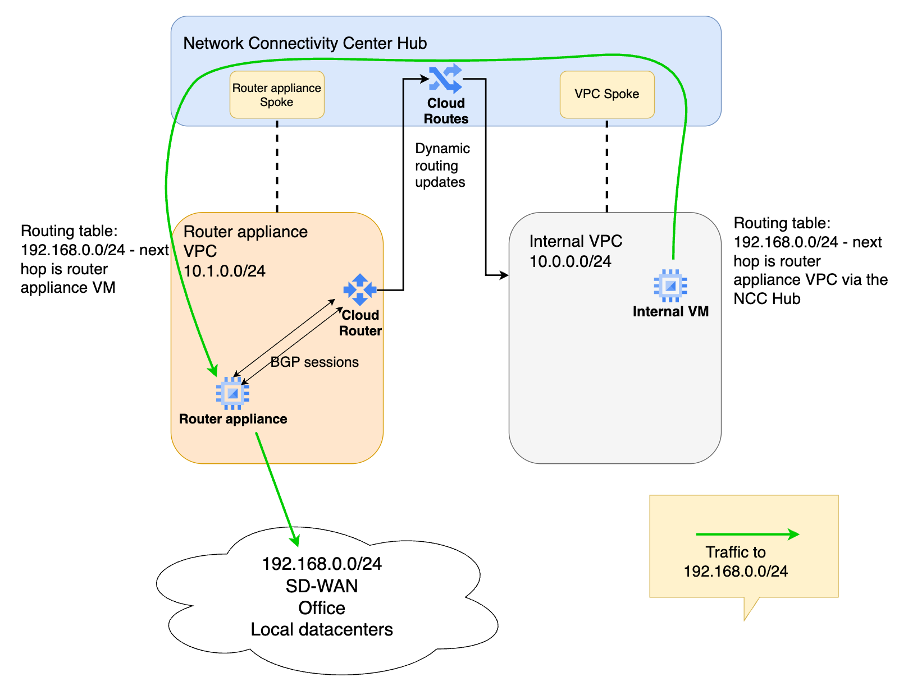

# Google Cloud Network Connectivity Center with Router Appliance

This project demonstrates a Network Connectivity Center (NCC) hub-and-spoke architecture with a router appliance in Google Cloud Platform, implemented using Terraform.

## Architecture Overview



The architecture consists of the following components:

### Network Components
- **Network Connectivity Center (NCC) Hub** - Central hub for network connectivity
- **Two VPC Networks**:
  - **Internal VPC** (10.0.0.0/24) - Simulating an internal network
  - **Router Appliance VPC** (10.1.0.0/24) - Hosting the network virtual appliance


### Connectivity Components
- **Cloud Router** - Provides redundant BGP peering with the router appliance
- **Router Appliance (NVA)** - Ubuntu VM with FRR providing BGP routing
- **NCC Spokes**:
  - VPC Spoke connecting Internal VPC to the NCC Hub
  - Router Appliance Spoke connecting the NVA to the NCC Hub

### Compute Resources
- **Internal VM** - Test VM in the internal VPC
- **NVA Instance** - Ubuntu VM with FRR installed and IP forwarding enabled

## Technical Details

### Network Configuration
- **Internal VPC**: Single subnet in europe-west1 (10.0.0.0/24)
- **Router Appliance VPC**: Single subnet in europe-west1 (10.1.0.0/24)
- **BGP ASNs**:
  - Cloud Router: ASN 64512
  - NVA Router: ASN 65001
- **Remote Network**: 192.168.0.0/24 (simulated via loopback interface on NVA)

### Router Appliance
- **Operating System**: Ubuntu 22.04 LTS
- **Routing Software**: FRR
- **IP Forwarding**: Enabled both at GCP instance level and OS kernel level
- **Redundant BGP Sessions**: Two BGP sessions to Cloud Router interfaces
- **Loopback Interface**: 192.168.0.1/24 configured to simulate a remote network

### High Availability
- Cloud Router configured with redundant interfaces
- BGP peers configured for failover

## Getting Started

### Prerequisites
- Google Cloud Platform account
- Terraform installed


### Deployment Steps
1. Clone this repository
2. Update `project_id` in `variables.tf`
3. Run the following commands:
   ```
   terraform init
   terraform plan
   terraform apply
   ```

The deployment will automatically configure:
- All necessary network components
- FRR configuration on the NVA with the correct BGP settings
- BGP peering between the Cloud Router and NVA
- Loopback interface on the NVA to simulate the remote network (192.168.0.0/24)


## Testing Connectivity
1. SSH into the Internal VM
2. Test connectivity to the simulated remote network (192.168.0.0/24) via the NVA
```
ping 192.168.0.1
```
3. Verify routes are being advertised correctly between VPCs (can be done on the Google Cloud Console webUI)

## Security Considerations

This deployment includes firewall rules that allow all ingress traffic by default. For production environments, implement more restrictive firewall rules based on the principle of least privilege.

## Cleanup

To clean up all resources: 
```
terraform destroy
```
This cleans up the whole deployment, all the VPCs, both VMs, Cloud Router, NCC setup and the firewall rules, so you are not charged for the resources anymore.